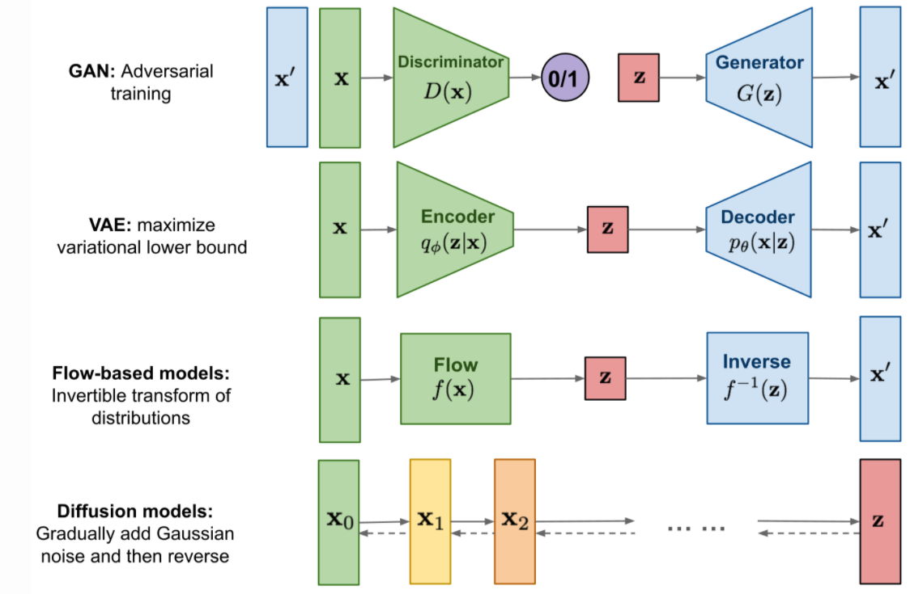

# Projet génération d'images

Auteurs : Lisa Giordani, Mouïn Ben Ammar, Yoldoz Tabei, Ilias Harkati (Groupe 6)

Cours : Projet IA (IA321)

Date : Mars 2022

Tuteur : Nacim Belkhir

## Contexte du projet

Le deep learning est de plus en plus utilisé en entreprise, mais nécessite une très grande quantité de données. La génération d’images peut donc s’avérer une solution pour des problématiques de data augmentation ou encore de généralisation des modèles. C’est dans ce contexte que ce projet s’inscrit. Il portera sur la génération d’images en s’appuyant sur les quatre stratégies principales existantes :
- les **GAN** (generative adversarial networks - réseaux antagonistes génératifs en Français) qui sont constitués d’un générateur et d’un discriminateur qui tente de deviner si une image est réelle ou a été créée par le générateur
- les **VAE** (variational autoencoders - autoencodeur variationnels en Français) qui sont des estimateurs de distribution non paramétriques
- les **flow-based generative models** ...
- les **modèles de diffusion** définissent une chaîne de Markov d'étapes de diffusions qui bruitent des données, pour ensuite apprendre à effectuer le processus inverse, et ce afin de construire des données à partir de bruit.

Une application de ce travail pourrait être la data augmentation pour servir des modèles de détection d’anomalies sur des chaînes de production de pièces aéronautiques par exemple ou encore l’apprentissage de représentations.

Voici une présentation schématique des architectures des modèles que nous avons étudiés :

