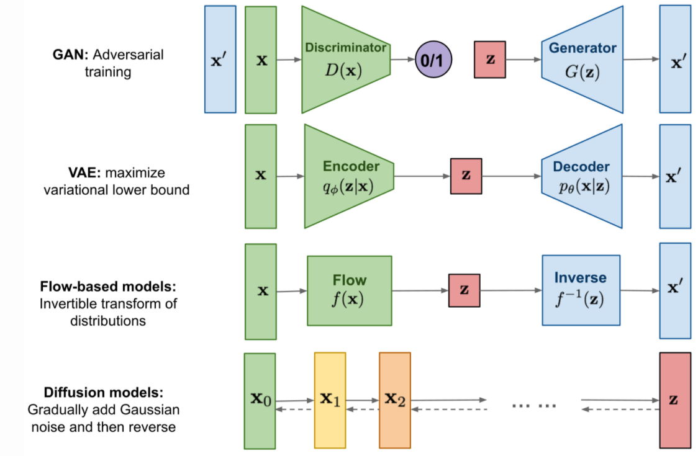
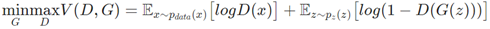
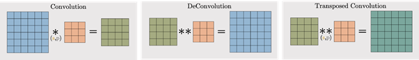
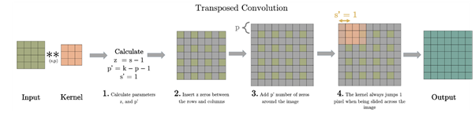
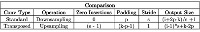

# CONTENU DU BLOG 

## GAN

**Sources** : 
- https://pytorch.org/tutorials/beginner/dcgan_faces_tutorial.html#introduction
- Goodfellow - Generative Adversarial Nets (2014)

“GANs are a framework for teaching a DL model to capture the training data’s distribution so we can generate new data from that same distribution. GANs were invented by Ian Goodfellow in 2014 and first described in the paper Generative Adversarial Nets. They are made of two distinct models, a generator and a discriminator. The job of the generator is to spawn ‘fake’ images that look like the training images. The job of the discriminator is to look at an image and output whether or not it is a real training image or a fake image from the generator. During training, the generator is constantly trying to outsmart the discriminator by generating better and better fakes, while the discriminator is working to become a better detective and correctly classify the real and fake images. The equilibrium of this game is when the generator is generating perfect fakes that look as if they came directly from the training data, and the discriminator is left to always guess at 50% confidence that the generator output is real or fake.

Now, lets define some notation to be used throughout tutorial starting with the discriminator. Let x be data representing an image. D(x) is the discriminator network which outputs the (scalar) probability that x came from training data rather than the generator. Here, since we are dealing with images, the input to D(x) is an image of CHW size 3x64x64. Intuitively, D(x) should be high when x comes from training data and low when x comes from the generator. D(x) can also be thought of as a traditional binary classifier.

For the generator’s notation, let z be a latent space vector sampled from a standard normal distribution. G(z) represents the generator function which maps the latent vector z to data-space. The goal of G is to estimate the distribution that the training data comes from (p_data) so it can generate fake samples from that estimated distribution (p_g).

So, D(G(z)) is the probability (scalar) that the output of the generator G is a real image. As described in Goodfellow’s paper, D and G play a minimax game in which D tries to maximize the probability it correctly classifies reals and fakes (logD(x), and G tries to minimize the probability that D will predict its outputs are fake (log(1-D(G(z))). From the paper, the GAN loss function is

In theory, the solution to this minimax game is where p_g = p_data, and the discriminator guesses randomly if the inputs are real or fake. However, the convergence theory of GANs is still being actively researched and in reality models do not always train to this point.”

D : classifieur binaire

**Générateur : convolution transposée** :

La convolution transposée n'inverse pas la convolution standard par valeurs (déconvolution), mais uniquement par dimensions.

En fonction des dimensions de l’output que l’on veut, on va choisir s et p :

source : https://towardsdatascience.com/what-is-transposed-convolutional-layer-40e5e6e31c11

## VAE

## Flow-based model

## Diffusion model
