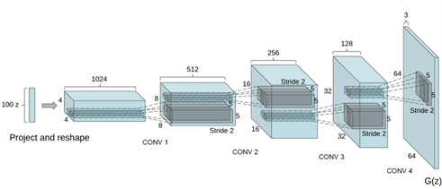

# Implémentation des GAN

# DCGAN

Fichier : _DCGAN.ipynb_

Modèle : DCGAN

Dataset : Celeba

Framework : Pytorch

Papier scientifique : _Unsupervised Representation Learning with Deep Convolutional Generative Adversarial Networks_, Alec Radford, Luke Metz, Soumith Chintala (2015). [Lien vers le papier](https://arxiv.org/abs/1511.06434)

**Générateur** :
La première couche consiste en le reshape du vecteur z ((100,1) -> (1,1,100)). Puis, on applique une convolution transposée avec aucun padding, ni stride (=1) et un kernel de taille 4.

Ensuite, pour transformer un input de dimensions (4,4,1024) en un output de dimensions (64,64,3) :
- on diminue la taille du channel (divise par 2 à chaque couche) en diminue le nombre de filtres appliqués par couche (divise par 2)
- on augmente la taille des autres dimensions (multiplie par 2 à chaque couche) en utilisant des convolutions transposée

**Discriminateur** :
D’après le papier du DCGAN, c'est une bonne pratique d'utiliser la strided convolution plutôt que le pooling pour le subsampling car cela permet au réseau d'apprendre sa propre fonction de pooling. De plus, les fonctions de batch norm et de leaky ReLU favorisent une descente de gradient efficace, ce qui est essentiel pour le processus d'apprentissage de G et D.

**Problèmes** : 
- très long de dézipper le dataset complet -> (1) ou (2)
- (1) :  arrêter de dézipper avant la fin et travailler sur training set réduit MAIS training sur 5 epochs du training set réduit très long (1h)
- (2) : erreur lorsqu’on charge les données sur Google Colab à partir d’un fichier local -> il faut dézipper directement dans Google Drive à partir de Google Colab (commande !unzip), puis importer le dataset à partir de Google Colab

**Résultats** :
- Sur un training set réduit (15 000 images) : mauvaise qualité (images très floues et on devine des visages) et peu de diversité.
- Sur le training set complet (plus de 100 000 images) : qualité moyenne (visages déformés) et diversité correcte (obtenus sur le site du tutoriel).

# StyleGAN

Fichier : _Mini_StyleGAN+FID.ipynb_

Modèle : StyleGAN

Dataset : CIFAR10

Framework :  Pytorch

Papier scientifique : A Style-Based Generator Architecture for Generative Adversarial Networks:
Tero Karras, Samuli Laine, Timo Aila
[Lien vers le papier](https://arxiv.org/abs/1812.04948)

**Générateur** :
Le Générateur consiste à 4 bloques, ou chacun parmi eux génére une image de taille 4,8,16,32.
Chaque bloque consiste en une (convolution->injection de bruit-> leakyRelu -> AdaIN) deux fois, chaque bloque est suivie d'une couche RGB qui tronsforme l'output de ce bloque en une image RGB

**Critique** :
Le Critique consiste à 4 bloques, ou chacun parmi eux clasifie une image de taille 32,16,8,4(image miroir du générateur.
Chaque bloque consiste en deux convolution plus une couche from_RGB qui re-transforme l'image donné en un tenseur.

# WGAN ,Conditional GAN

Fichier : _WGAN-ConditionalGAN.ipynb_

Modèle : WGAN et génération conditionnelle

Dataset : CIFAR10

Framework :  Pytorch

Papier scientifique :Conditional Generative Adversarial Nets
Mehdi Mirza, Simon Osindero
[Lien vers le papier](https://arxiv.org/abs/1411.1784)

Wasserstein GAN
Martin Arjovsky, Soumith Chintala, Léon Bottou
[Lien vers le papier](https://arxiv.org/abs/1701.07875)

**Générateur** :
Générateur simple qui consiste à empiler des block de convolution + batchnorm + upsampling

**Discriminateur** :
Discriminateur simple qui consiste à empiler des block de convolution + batchnorm 

cette architecture a été développée simplement pour se familiariser avec les GAN, et même si ses résultats étaient convenable, elle a été abandonnée pour se concentrer sur le développement de mon objectif principal de ce projet, un mini-SyleGAN qui peut être entrainé sur un petit GPU.

